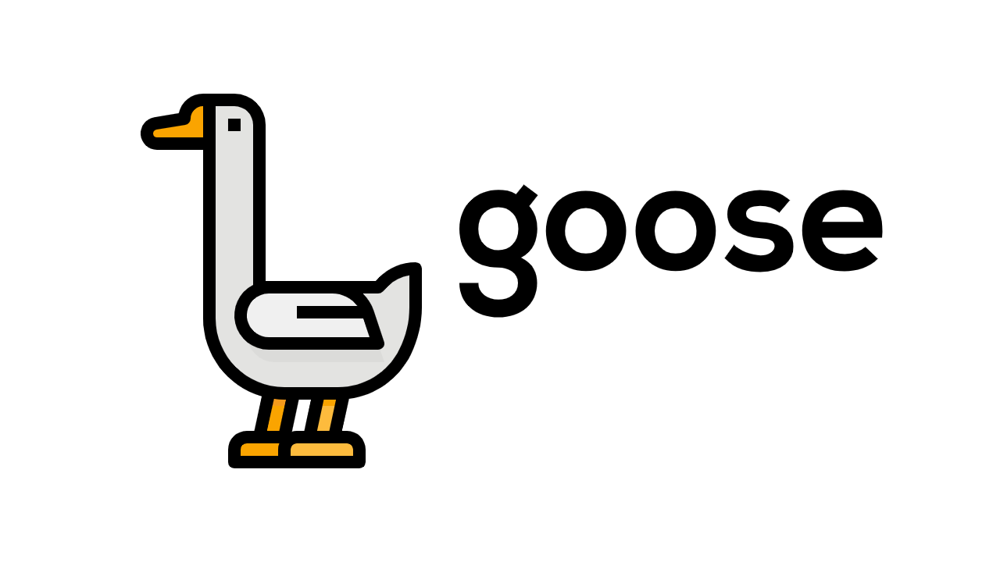

# goose

<a href="https://github.com/zhoudaxia233/goose"></a>

**goose** is a lightweight web framework in Go.

<details>
<summary><strong>A hello world example</strong></summary>

```go
package main

import (
	"github.com/zhoudaxia233/goose"
)

func main() {
	g := goose.New()

	g.GET("/", func(ctx *goose.Context) {
		ctx.String("Hello World!")
	})

	g.Run(":8080")
}
```

</details>

## Contents
- [goose](#goose)
	- [Contents](#contents)
	- [Features](#features)
		- [Dynamic Routing](#dynamic-routing)

## Features
### Dynamic Routing

<details>
<summary><strong>An example</strong></summary>

```go
package main

import (
	"github.com/zhoudaxia233/goose"
)

func main() {
	g := goose.New()

	g.GET("/info/:name", func(ctx *goose.Context) {
		ctx.String("My name is %s", ctx.Param(":name"))
	})

	g.Run(":8080")
}

```

</details>